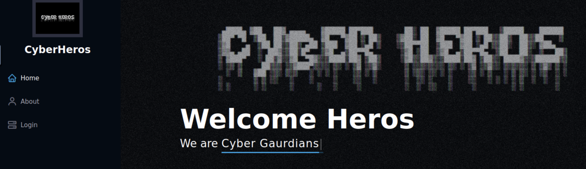
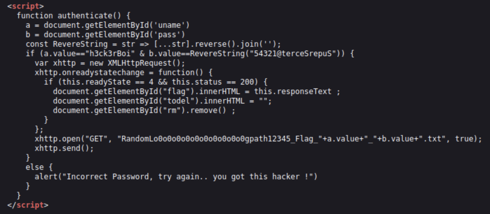
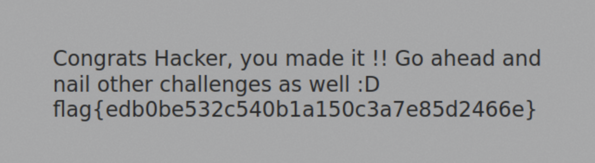

# TryHackMe - CyberHeroes

This is a CTF where we have to bypass authentication.

1. When we go to the website, we see the homepage with a navigation bar on the side. Here we see the login. Let's click on that.



2. We see a login page. Let's look at the source code to see if we can find anything interesting.

3. In the source code we can see that there is a username: h3ck3rBoi, and a password: 54321@terceSrepuS. The password looks a bit odd. Let's try to reverse it.



4. We use python to reverse the string. We can do this by using the following code:

```bash
python3 -c "print('54321@terceSrepuS'[::-1])"
```

The password is therefore: SuperSecret@12345

5. When we type in the username and password, we get the following flag: flag{edb0be532c540b1a150c3a7e85d2466e}


