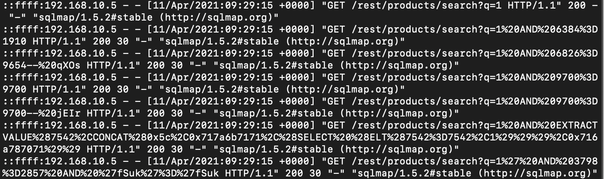
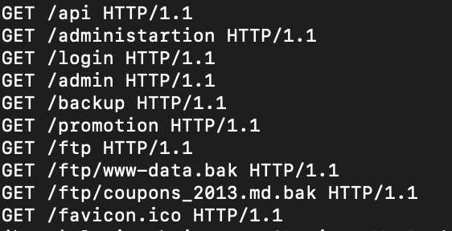
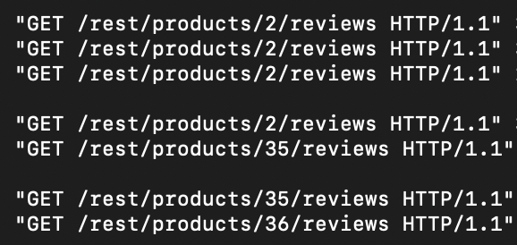
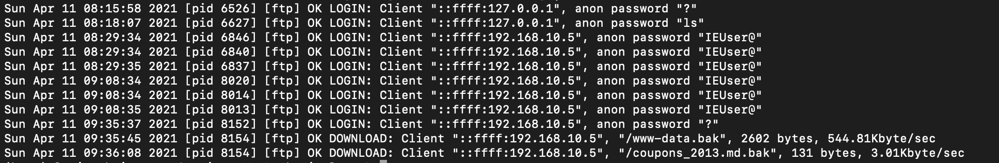
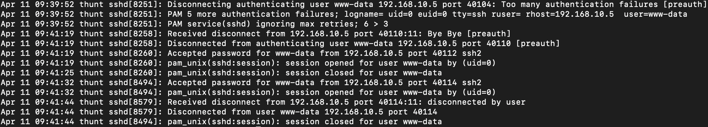

# TryHackMe - Juicy Details

This is a CTF where we have to analyze log files. We have been given three log files and we have to answer the questions based on the information we get from the log files.

# Task - Reconnaissance

```bash
1. What tools did the attacker use? (Order by the occurrence in the log)
```

We need to at the User-Agent headers to solve this. Let's take a look at the following Github repository: https://github.com/WindomZ/user-agent-string to figure out how to write this in the terminal.

```bash
$ cat access.log | cut -d '"' -f 6 | uniq

Here -d is the delimiter and -f is the field. We are using the double quotes as the delimiter and the 6th field is the User-Agent header.
```

```bash
The answer is: nmap, hydra, sqlmap, curl, feroxbuster
```

```bash
2. What endpoint was vulnerable to a brute-force attack?
```

We need to look at the status codes to solve this. Status code explanation:

```bash
100-199 - Informational
200-299 - Success
300-399 - Redirection
400-499 - Client Error
500-599 - Server Error
```

```bash
$ grep -E "HTTP/1.1\" 500|hydra" access.log | uniq
```

```bash
The answer is: /rest/user/login
```

```bash
3. What endpoint was vulnerable to SQL injection?
```

```bash
$ cat access.log | grep -i sqlmap | sort -u | head
```



```bash
The answer is: /rest/products/search
```

```bash
4. What parameter was used for the SQL injection?
```

```bash
$ grep -E "HTTP/1.1\" 500|sqlmap" access.log | uniq
```

```bash
The answer is: q
```

```bash
5. What endpoint did the attacker try to use to retrieve files?
```

```bash
$ cat access.log | cut -d '"' -f 2 | uniq
```



```bash
The answer is: /ftp
```

```bash

```

# Stolen data

```bash
1. What section of the website did the attacker use to scrape user email addresses?
```

```bash
Users can usually comment on the website under "reviews". Let's try to use grep to see if there is something called "review" in the log files.

$ grep -i review access.log | uniq
```



```bash
The answer is: product reviews
```

```bash
2. Was their brute-force attack successful? If so, what is the timestamp of the successful login? (Yay/Nay, 11/Apr/2021:09:xx:xx +0000)

We can use the same command as before to find the timestamp of the successful login.

$ cat access.log | grep -i hydra | grep 200
```


```bash
The answer is: Yay, 11/Apr/2021:09:16:31 +0000
```

```bash
3. What user information was the attacker able to retrieve from the endpoint vulnerable to SQL injection?
```

```bash
$ cat access.log | grep password
```

```
The answer is: email, password
```

```bash
4. What files did they try to download from the vulnerable endpoint? (endpoint from Q5)
```

```bash
From previous questions we know that the endpoint is /ftp. Let's try to use grep to find the files.

$ grep -i ftp access.log | uniq

We found out that there were two .bak files that were downloaded. One being "www-data.bak" and the other one being "coupons_2013.md.bak".

The answer is therefore coupons_2013.md.bak, www-data.bak.
```

```bash
5. What service and account name were used to retrieve files from the previous question? (service, username)
```

```bash
We can use the same command as before to find the service and username.

$ grep -i ftp vsftpd.log | uniq

The answer is therefore ftp, anonymous.
```



```bash
6. What service and username were used to gain shell access to the server?
```

```bash
$ grep -i ssh auth.log | uniq

The answer is therefore ssh, www-data.
```


